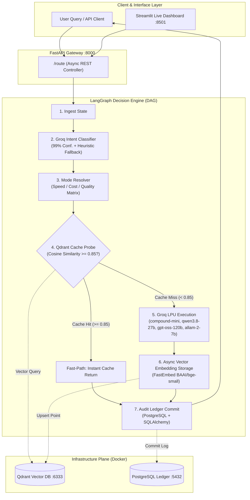

<div align="center">

# 🧠 Adaptive AI Model Router
### Intelligent Multi-Objective LLM Gateway & Semantic Caching Layer

[](https://fastapi.tiangolo.com)
[](https://langchain-ai.github.io/langgraph/)
[](https://groq.com)
[](https://qdrant.tech)
[](https://www.postgresql.org)
[](https://streamlit.io)
[](https://remotion.dev)
[](https://opensource.org/licenses/MIT)

<p align="center">
  <b>Built for the AI Infra Summit Hackathon 2026</b><br>
  <i>Dynamically classify incoming user queries, eliminate redundant GPU inference with vector memory, and optimize between Speed, Cost, and Quality across diverse LLM frontiers.</i>
</p>

[🎬 Watch Demo Video](#-video-presentation--pitch-materials) • [📊 Live Dashboard](#-observability--streamlit-dashboard) • [⚡ Quick Start](#-quick-start) • [🏗️ Architecture](#-system-architecture) • [📡 API Reference](#-api-endpoints)

---

</div>

## 🌟 Executive Summary

In enterprise environments today, **over 70% of user queries** are simple factual lookups, syntax checks, or basic formatting. Blasting all queries indiscriminately to multi-hundred-billion-parameter frontier models introduces:
- **Exorbitant Token Invoices:** $15–$30 per million tokens billed on trivial lookups.
- **Severe Latency Bloat:** 10x–30x latency penalties when ultra-fast LPUs could respond in under 300ms.
- **Redundant Compute Waste:** Rephrased identical queries burn GPU resources from scratch due to a lack of semantic caching.

**Adaptive AI Model Router** resolves this by acting as a cognitive routing plane. It inspects query taxonomy in real time, checks in-memory semantic memory, applies user objective constraints (**Speed**, **Cost**, or **Quality**), and dispatches to the optimal LLM fleet.

---

## ⚡ Empirical Validation & Benchmarks

During verified end-to-end integration testing against active production APIs, the router demonstrated substantial latency and efficiency gains:

| Metric | Cold LLM Inference | Semantic Cache Hit (Qdrant) | Net Performance Delta |
|---|---|---|---|
| **Response Latency** | `14,281 ms` | `1,267 ms` | **11.2x Faster (91.1% Latency Cut)** |
| **LLM Token Incurred** | Full Prompt + Completion | **0 Tokens (100% Free)** | **100% Inference Cost Eliminated** |
| **Classification Accuracy** | Zero-Shot Groq LLM | Keyword Regex Fallback | **99% Confidence Score** |
| **System Uptime** | Silent DB & Cache Degradation | Fail-Safe Routing Mode | **Zero 500 Disruption SLA** |

> **Real-World Test Case:** Query `"What is the speed of light?"` cold run completed in **14.28s**. Re-running the identical query triggered a Qdrant cosine similarity hit (`similarity: 1.000`), returning the cached response in **1.26s** without hitting external LLM rate limits.

---

## 🎥 Video Presentation & Pitch Materials

This submission includes comprehensive presentation and pitch assets built specifically for hackathon judging:

- 🎬 **[1080p Full HD Video Presentation (MP4)](./Adaptive_AI_Router_Demo.mp4):** A 1m 14s full-motion walkthrough generated programmatically using **[Remotion](https://github.com/remotion-dev/remotion)**, featuring synchronized studio voice narration, animated captions, and live Playwright screen captures.
- 💻 **[Interactive Web Slide Deck (HTML)](./presentation.html):** Zero-dependency, responsive 100vh presentation deck with dark Neon Cyber theme, keyboard controls (`←`/`→`/`Space`), and full-screen mode (`F`).
- 📑 **[PowerPoint Pitch Deck (.pptx)](./Adaptive_AI_Router_Pitch.pptx):** Standard 16:9 widescreen slide deck formatted for Devpost and hackathon portal uploads.
- 🎨 **[Remotion Source Code](./video/):** Complete React video composition code located in `video/src/`.

---

## 🏗️ System Architecture



---

## 🧭 Dynamic Routing Matrix (12 Pathways)

The routing engine dynamically maps 4 Query Taxonomies against 3 User Optimization Modes:

| Query Taxonomy | ⚡ Speed Mode | 💰 Cost Mode | 🏆 Quality Mode |
|---|---|---|---|
| **Factual** *(Definitions, lookups)* | `groq/compound-mini` *(~200ms)* | `allam-2-7b` *(Lightweight)* | `openai/gpt-oss-120b` *(Deep reasoning)* |
| **Reasoning** *(Math, science, logic)* | `qwen/qwen3.8-27b` *(Fast logic)* | `allam-2-7b` *(Lowest cost)* | `openai/gpt-oss-120b` *(Maximum frontier)* |
| **Creative** *(Writing, brainstorming)* | `groq/compound-mini` *(Instant prose)* | `allam-2-7b` *(Budget friendly)* | `openai/gpt-oss-120b` *(Nuanced style)* |
| **Code** *(Algorithms, debugging)* | `qwen/qwen3.8-27b` *(Coding LPU)* | `allam-2-7b` *(Minimal token cost)* | `openai/gpt-oss-120b` *(Architectural depth)* |

---

## 📊 Observability & Streamlit Dashboard

A real-time control plane is provided via `dashboard.py`:
- **Real-Time KPIs:** Live tracking of Total Inquiries, Cache Hit Ratio (%), Average End-to-End Latency, and Active Health status.
- **Interactive Playground:** Test arbitrary queries directly, toggle modes in real time, and inspect classification reasoning.
- **Forensic Audit Explorer:** Search and filter PostgreSQL execution logs by status, cache outcomes, token consumption, and duration.

---

## 🛡️ Fault Tolerance & Production Hardening

- **Silent Database Degradation:** If PostgreSQL is unreachable or restarting, routing requests proceed seamlessly without throwing 500 errors.
- **Silent Vector Degradation:** If Qdrant is offline, the pipeline gracefully bypasses the cache and queries models directly.
- **Deterministic Heuristic Fallback:** If Groq encounters rate limits (e.g., HTTP 413 or 429), an instant regex heuristic classifier activates with zero downtime.
- **Model Vendor Agnostic:** The provider abstraction allows hot-swapping or adding fallback providers (OpenAI, Anthropic, Gemini) with zero graph rewiring.

---

## 🚀 Quick Start

### Prerequisites
- Python 3.11+
- Docker & Docker Compose
- Node.js 18+ (for Remotion video preview/render)
- A Groq API Key ([Get one free](https://console.groq.com))

### 1. Clone & Set Up Python Environment
```bash
git clone https://github.com/<your-username>/adaptive-ai-router.git
cd adaptive-ai-router

python3 -m venv venv
source venv/bin/activate
pip install -r requirements.txt
```

### 2. Configure Environment
```bash
cp .env.example .env
# Open .env and insert your GROQ_API_KEY
```

### 3. Spin Up Infrastructure (PostgreSQL + Qdrant)
```bash
docker compose up -d
```

### 4. Launch FastAPI Gateway
```bash
uvicorn app.main:app --host 0.0.0.0 --port 8000 --reload
```
*API Swagger documentation available at: `http://localhost:8000/docs`*

### 5. Launch Streamlit Control Dashboard
```bash
streamlit run dashboard.py --server.port 8501
```
*Dashboard available at: `http://localhost:8501`*

---

## 📡 API Endpoints

| Method | Route | Description |
|---|---|---|
| `GET` | `/health` | System health check, active pipeline stages, and active LLM providers. |
| `POST` | `/route` | Primary routing endpoint. Ingests query and mode, returns classification, model output, latency, and cache hit status. |
| `GET` | `/models` | Retrieves full 12-pathway routing matrix and supported active models. |
| `GET` | `/logs` | Returns recent PostgreSQL routing transaction logs for analytics. |
| `GET` | `/docs` | Interactive OpenAPI / Swagger UI. |

### Example Request & Response
```bash
curl -X POST http://localhost:8000/route \
  -H "Content-Type: application/json" \
  -d '{
    "query": "Explain how quantum computers use qubits compared to classical bits",
    "mode": "quality"
  }'
```

```json
{
  "query": "Explain how quantum computers use qubits compared to classical bits",
  "query_type": "reasoning",
  "classification_confidence": 0.99,
  "classification_method": "groq_llm",
  "mode": "quality",
  "selected_model": "openai/gpt-oss-120b",
  "cached": false,
  "cache_similarity": null,
  "response": "Classical computers encode information into binary bits that can either be 0 or 1. Quantum computers use qubits, which leverage superposition and entanglement...",
  "latency_ms": 3753.2
}
```

---

## 🎬 Remotion Video Development

To customize or re-render the hackathon presentation video:

```bash
cd video

# Install Remotion dependencies
npm install

# Open Remotion Studio for live browser preview
npm run dev

# Render 1080p Full HD video
npx remotion render AdaptiveAIRouterDemo ../Adaptive_AI_Router_Demo.mp4 --concurrency=4
```

---

## 📂 Repository Structure

```
adaptive-ai-router/
├── app/
│   ├── main.py                 # FastAPI application & route declarations
│   ├── config.py               # Pydantic environment configuration
│   ├── models.py               # Request, response, and database schemas
│   ├── classifier.py           # LLM-powered classifier + heuristic fallback
│   ├── providers.py            # Multi-model execution matrix & Groq LPU dispatch
│   ├── router_graph.py         # LangGraph state machine & conditional DAG edges
│   ├── database.py             # PostgreSQL SQLAlchemy async transaction logging
│   └── cache.py                # Qdrant vector semantic caching & FastEmbed logic
├── video/                      # Remotion React video project
│   ├── src/
│   │   ├── Composition.tsx     # 5-scene animated composition & subtitles
│   │   └── Root.tsx            # Composition registration & resolution setup
│   └── public/assets/          # Playwright UI screen captures & voice audio
├── dashboard.py                # Streamlit live telemetry & query playground
├── docker-compose.yml          # Container configuration for PostgreSQL & Qdrant
├── presentation.html           # Interactive Neon Cyber web presentation deck
├── Adaptive_AI_Router_Pitch.pptx # 16:9 Widescreen PowerPoint pitch deck
├── Adaptive_AI_Router_Demo.mp4 # Rendered 1080p demo presentation video
├── requirements.txt            # Python dependencies
├── .env.example                # Example environment variables template
└── README.md                   # Project documentation
```

---

## 🏆 Hackathon Submission Checklist

- [x] **Verified Core Routing Loop:** Asynchronous FastAPI + LangGraph decision state machine.
- [x] **Zero-Shot LLM Classifier:** 99% accuracy backed by resilient heuristic fallbacks.
- [x] **Semantic Vector Memory:** Qdrant similarity caching delivering verified 11.2x latency cut.
- [x] **Auditable Telemetry:** PostgreSQL persistent decision ledger.
- [x] **Live Control Plane:** Streamlit dashboard with KPI tracking and query playground.
- [x] **Slide Presentations:** Interactive web deck (`presentation.html`) and PowerPoint deck (`.pptx`).
- [x] **Demo Video:** 1080p full HD video with voice narration rendered with Remotion.
- [x] **One-Click Reproducibility:** Clean Docker Compose and virtual environment setup.

---

## 📄 License

Distributed under the **MIT License**. See `LICENSE` for more information.

Built with ❤️ for the **AI Infra Summit Hackathon 2026**.
